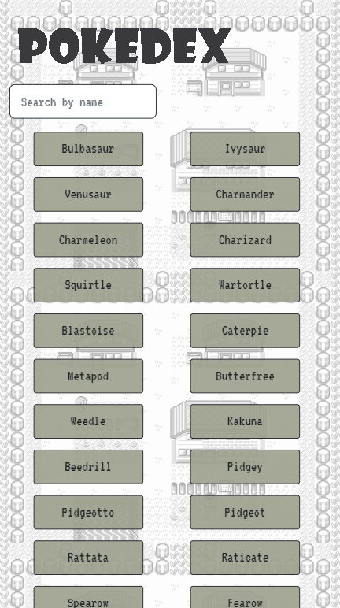

# A JavaScript App

This is a small web application built with HTML, CSS, JavaScript, some JQuery, and Bootstrap.  The app loads data from an external API, the [PokeAPI](https://pokeapi.co/docs/v2") and enables the viewing of data points in detail.

This project was built as part of the Career Foundry Full-Stack Immersion course in the Full-Stack Web Development Program and was inspired by the Red and Blue Pokemon games played on a black and white Gameboy.

The app was first written in HTML, CSS and JavaScript to fetch the data using from the API and dynamically display buttons for each Pokemon.  The buttons would load a modal through JavaScript that would display the Pokemon image and imformation.  The app was then reworked to implement Bootstrap to display the modal and format the interface.

## Features

- Data for the first 151 Pokemon are loaded from the PokeAPI
- Fetch and Promise Pollyfills are used
- The user can search for a Pokemon by name using a search bar at the top of the page
- When the button for the chosen Pokemon is clicked, a modal displays their image and information

## Dependendcies

- JQuery
- Bootstrap

## Screenshots

   

   

## Link

[Live App Available Here!](https://kellysdev.github.io/Pokedex/)

## Future Updates

- [ ] Add Pokemon sprites to buttons
- [ ] Add more search functions
- [ ] Pull flavor text from the API
- [ ] Format modal body

## Credit and Contact

Thank you to those behind the PokeAPI for compiling so much data and making it available to the public.
Thanks also go to my patient tutor, Jason, and my mentor, Vini, at Career Foundry.
